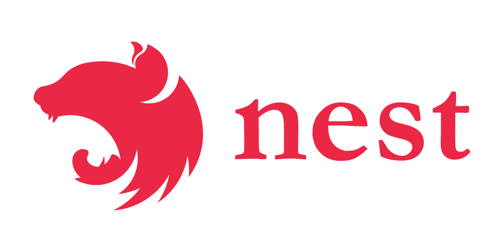
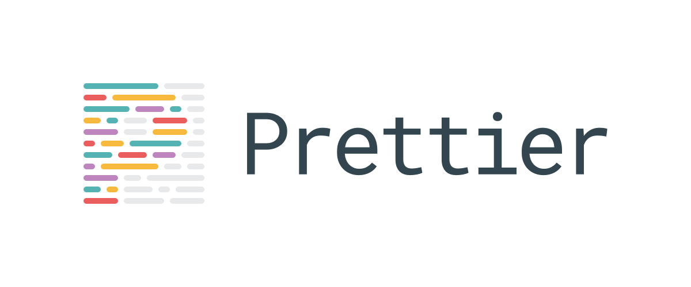
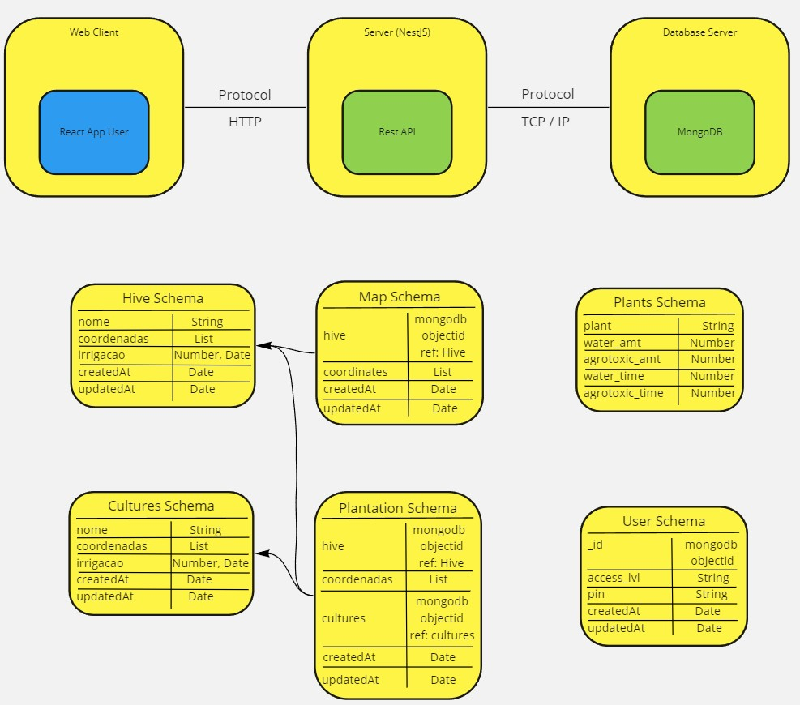

<p align="center">
  <a href="http://nestjs.com/" target="blank"></a>
  
    
  
  
</p>
<p align="center">

</p>

[travis-image]: https://api.travis-ci.org/nestjs/nest.svg?branch=master
[travis-url]: https://travis-ci.org/nestjs/nest
[linux-image]: https://img.shields.io/travis/nestjs/nest/master.svg?label=linux
[linux-url]: https://travis-ci.org/nestjs/nest

  <p align="center">Uma estrutura progressiva do <a href="http://nodejs.org" target="blank">Node.js</a>  para criar aplicativos do lado do servidor eficientes e escaláveis, fortemente inspirados no <a href="https://angular.io" target="blank">Angular</a>.</p>
    <p align="center">
<a href="https://www.npmjs.com/~nestjscore"></a>
<a href="https://www.npmjs.com/~nestjscore"></a>
<a href="https://www.npmjs.com/~nestjscore"></a>
<a href="https://travis-ci.org/nestjs/nest"></a>
<a href="https://travis-ci.org/nestjs/nest"></a>
<a href="https://coveralls.io/github/nestjs/nest?branch=master"></a>
<a href="https://gitter.im/nestjs/nestjs?utm_source=badge&utm_medium=badge&utm_campaign=pr-badge&utm_content=body_badge"></a>
<a href="https://opencollective.com/nest#backer"></a>
<a href="https://opencollective.com/nest#sponsor"></a>
  <a href="https://paypal.me/kamilmysliwiec"></a>
  <a href="https://twitter.com/nestframework"></a>
</p>
  <!--[](https://opencollective.com/nest#backer)
  [](https://opencollective.com/nest#sponsor)-->

## Descrição
A estrutura deste programa pode ser vista na imagem abaixo.
<p align="center">
  
</p>
Imagem desenvolvida por <a href="mailto:miguelzanela89@gmail.com?">Miguel Zanela</a>


## Pré-requisito
- [Node.js versão 16.17.0](https://nodejs.org/en/)
- [Typescript] "3.4.5" ou maior (https://www.typescriptlang.org)
- [NestJS] "6.0" ou maior (https://nestjs.com)
- [MongoDB] "3.2.7" ou maior (https://www.mongodb.com)

## Instalação

```bash
$ npm install
```

## Rodando o Aplicativo

```bash
# development
$ npm run start

# watch mode
$ npm run start:dev

# production mode
$ npm run start:prod
```

## Sonarqube
Para realizar uma varredura no código, a ferramenta do solarqube pode ser utilizada, para isso você pode executar os seguintes passos:

Baixar e instalar uma versão do Sonarqube deste [link](https://docs.sonarqube.org/latest/setup/get-started-2-minutes/)

Após isso, seguir os passos disponíveis no guia da própria Sonarqube.

## Testes

```bash
# testes unitários
$ npm run test

# testes e2e 
$ npm run test:e2e

# cobertura de teste
$ npm run test:cov
```

## Suporte

Nest é um projeto de código aberto licenciado pelo MIT. Pode crescer graças aos patrocinadores e suporte dos incríveis apoiadores. Se você gostaria de entrar no time, por favor [leia mais aqui](https://docs.nestjs.com/support).

## Contatos

- Autor - [Kamil Myśliwiec](https://kamilmysliwiec.com)
- Página da Web - [https://nestjs.com](https://nestjs.com/)
- Twitter - [@nestframework](https://twitter.com/nestframework)

## Licença

  Nest é [licenciado pelo MIT](LICENSE).
